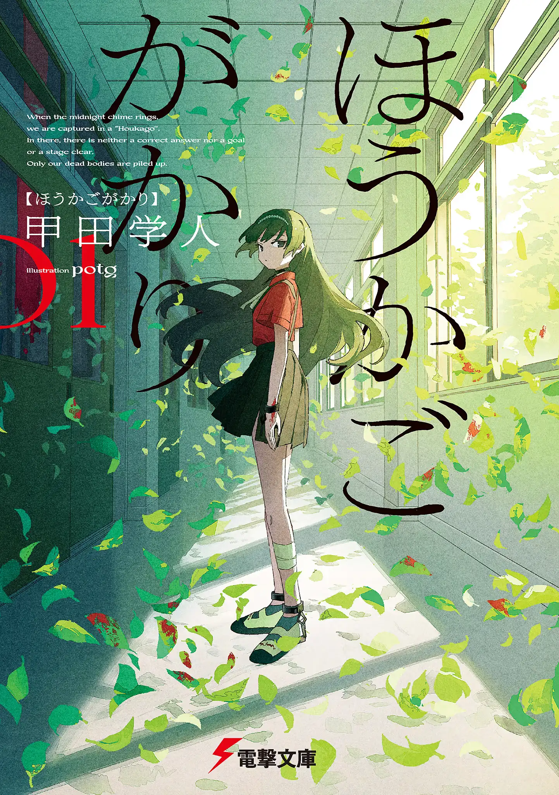
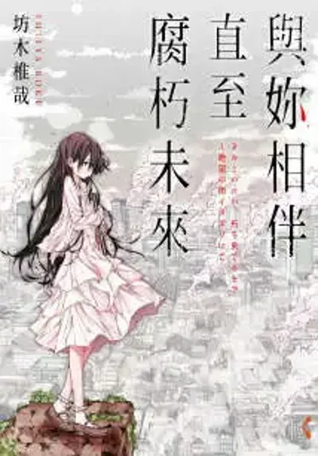

# [人性x奇幻]是放手一搏还是走向毁灭？

## 《放学后委员会》



这是记录。  

记录了无情的命运，  
记录了愤怒，  
记录了渐渐走投无路的小孩子们注定一死的战斗。

当午夜十二点的铃声响起。  
我们会被困在「放学后」。  
那里没有正确答案，没有终点，没有通关。  
只有堆起来的，我们的尸体。  

这是恐惧与绝望所统治的“午夜奇谭”  
  
```  
前三卷是一个完整的篇章。  
是性格各异的孩子们，在死亡的重压下各自做出不同选择的故事。
```


##  《与你相伴直至腐朽未来》



怀抱着各种隐情的人们聚集之处，是由被世界驱逐的人们所构筑起来的小镇──板切町。  

日复一日从事收集垃圾和搬运尸体的少年晴史，专门靠绘制肖像画拉客的女孩雫。  

在绝望世界里相遇的少年与少女所编织出的终极之爱究竟是？  

```
对于色彩的运用炉火纯青的作品，一同腐朽下去的终极之爱。
```