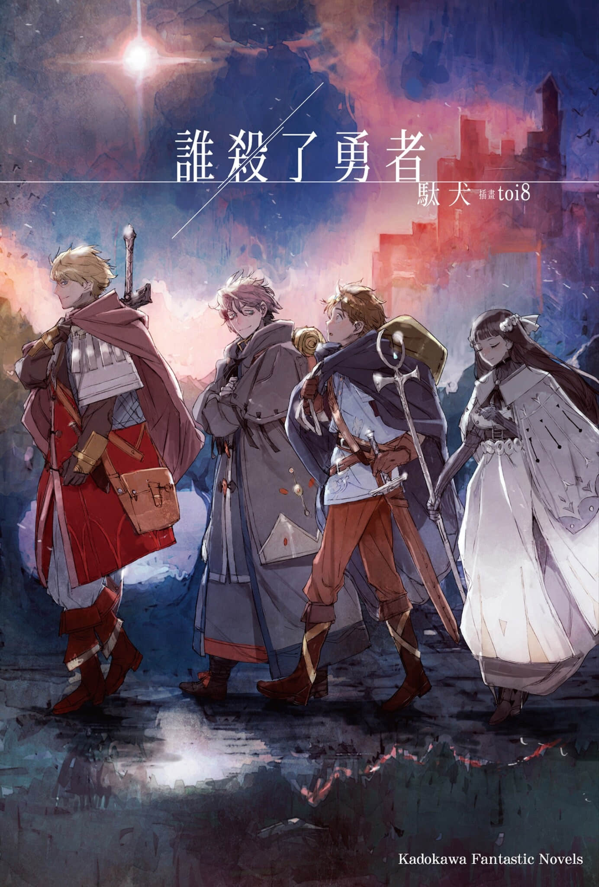
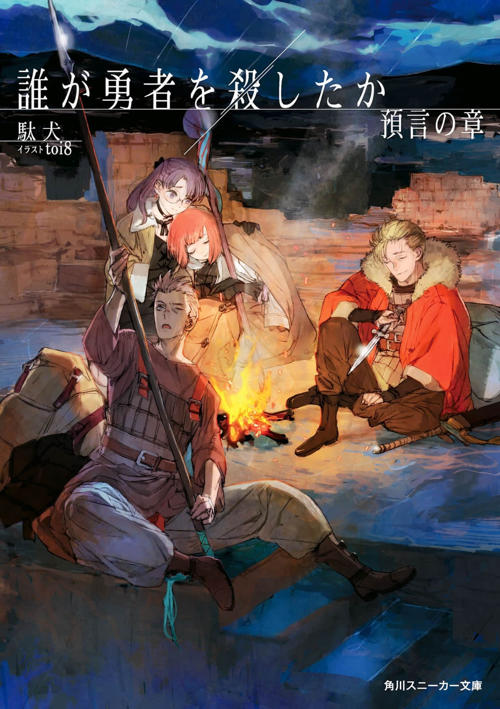

# [王道征途]人类的赞歌即是勇气的赞歌

## 《是谁杀死了勇者》

勇者打倒了魔王，但与此同时——他也成为了无法归来之人。

勇者打倒魔王后过了四年。

终于从战后的阴影中恢复过来的王国，为了称颂亡故的勇者，打算将他事迹编纂成册，来纪念他的伟业。

但勇者的同伴却一致的对勇者之死背后的真相保持了沉默。

“为什么，勇者亡故了呢？”杀死勇者的凶手是魔王吗？还是他过去的同伴？

王国与冒险者们的宿命和纠葛交织缠绕的群像剧，让人目不暇接的奇幻悬疑故事即将拉开帷幕。

残酷的真相，耀眼的人格。这不是天才的传奇，而是普通人的故事。

##  《是谁杀死了勇者 预言之章》

《是谁杀死了勇者》的续作。

原本作者没有出第二卷的打算，不过第一卷大火之后，还是出了第二卷。  

质量和第一卷基本持平，所以算不上狗尾续貂，是比第一卷更加深入的故事，值得一读。