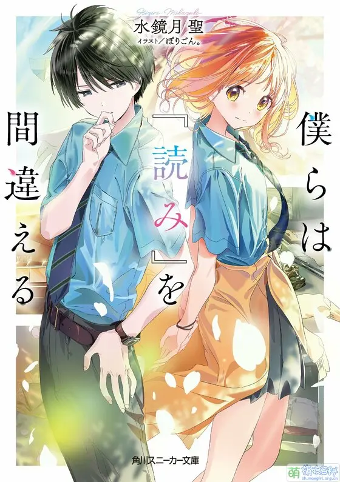

# [青春X推理]最大的谜团是ta的心思

耀眼的青春遇上心思缜密的主角，生活中的谜题一一解开。不过，最大的谜团，还是ta心底的感情。

## 《我们的阅读理解出错了》


学生这种生物，每天都在寻找着“不明白的东西”的答案。明天测验的答案，在班里的风评，喜欢的人所喜欢的人。

在升入高中的春天，那份“误会”开始了。

“你来得正好。我有点头疼的事情啊”

被太阳少女宗像濑奈所收集的学园中的小小谜团们——

那些，原来是将无数恋爱交缠在一起的事件（Mistery）。

```
本类型中最出色的作品。  
多视角设计，自然地埋下又回收伏笔。剧情错综复杂，推进流畅，人物刻画丰满。文笔细腻同时又不失对于整体的掌控。  
优秀的插画也是锦上添花。  
```
