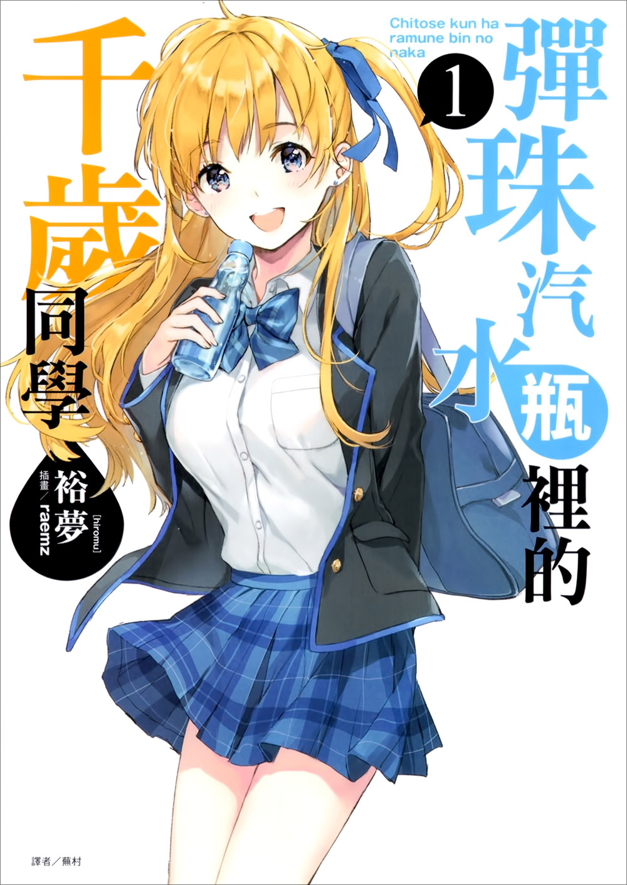

# [青春]一般青春的酸甜苦辣

这里没有超能力，没有穿越，没有恋爱喜剧。  
只有家庭，校园，朋友，恋人，只有普通人的青春生活。  
这是懵懂而又热烈的岁月。

## 《弹珠汽水瓶里的千岁同学》



「如果不能优美地活着，那和死去没有分别。

我想活得优美，犹如那天看见的那轮明月。

犹如在某本书上读到的，沉在没有打开瓶盖的汽水瓶底下的弹珠。」

君临藤志高中阶级制度顶层的现充，千岁朔。

本书是他的现充后宫传，还是──？宣告新时代来临的「现充视角」青春爱情故事，在此堂堂开幕！！

```
第一本现充视角的轻小说。  
除此之外也是一部超出平均水准，没什么短板的作品。 
值得一读。续作从第四卷之后就比较一般了。
```